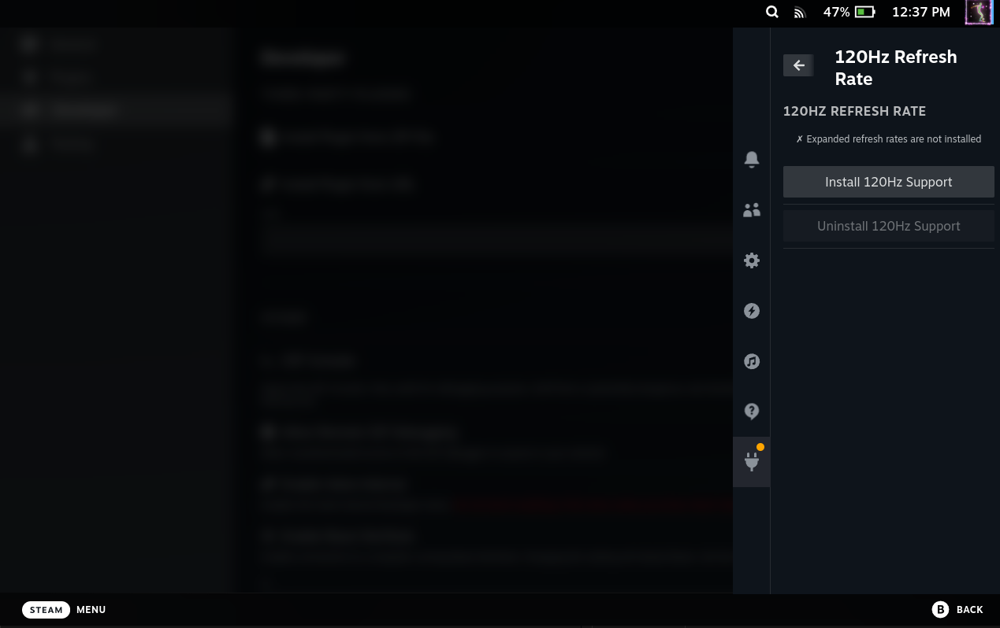

# 120 Hrtz Refresh Rate



Decky Loader plugin that installs or removes expanded refresh rate support for Steam Deck OLED.

It automates the process of enabling higher refresh rates on Steam Deck OLED by managing the required Lua script for gamescope.

## What it does

from [deck-refresh-rate-expander](https://github.com/xXJSONDeruloXx/deck-refresh-rate-expander).

- **Install**: Downloads `valve.steamdeck.oled.expanded.lua` to `~/.config/gamescope/scripts/displays/`
- **Uninstall**: Removes the lua script from that directory

A reboot is required after either action for changes to take effect.

## Development

### Dependencies

- Node.js v16.14+
- pnpm v9

```bash
sudo npm i -g pnpm@9
```

### Build

```bash
pnpm i
pnpm run build
```

### VSCode Tasks

Use the `setup`, `build`, and `deploy` tasks for streamlined development.